# Rummage.Phoenix

[](https://travis-ci.org/Excipients/rummage_phoenix)
[](https://coveralls.io/github/Excipients/rummage_phoenix?branch=master)
[](https://hex.pm/packages/rummage_phoenix)
[](https://hex.pm/packages/rummage_phoenix)
[](https://hexdocs.pm/rummage_phoenix)
[](http://inch-ci.org/github/Excipients/rummage_phoenix)
[](https://raw.githubusercontent.com/Excipients/rummage_phoenix/master/LICENSE)

`Rummage.Phoenix` is a support framework for `Phoenix` that can be used to manipulate `Phoenix` collections and `Ecto`
models with Search, Sort and Paginate operations.

It accomplishes the above operations by using `Rummage.Ecto`, to paginate `Ecto` queries and adds Phoenix and HTML
support to views and controllers. For information on how to configure `Rummage.Ecto` visit
[this](https://github.com/Excipients/rummage_ecto) page.

The best part about rummage is that all the three operations: `Search`, `Sort` and `Paginate` integrate seamlessly and
can be configured separately. To check out their seamless integration, please check the information below.

**NOTE: `Rummage` is not like `Ransack`, and doesn't intend to be either. It doesn't add functions based on search params.
If you'd like to have that for a model, you can always configure `Rummage` to use your `Search` module for that model. This
is why Rummage has been made configurable.**

________________________________________________________________________________________________

**Search, Sort and Paginate seamlessly in Phoenix!**

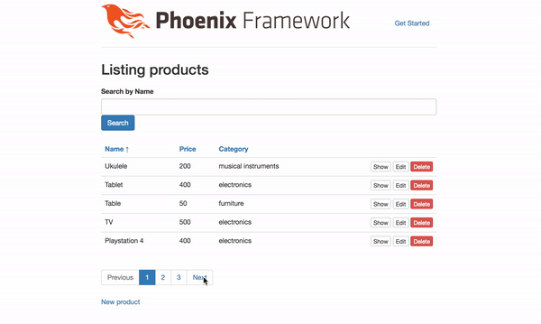

________________________________________________________________________________________________

## Installation

This is [available in Hex](https://hexdocs.pm/rummage_phoenix/), the package can be installed as:

  - Add `rummage_phoenix` to your list of dependencies in `mix.exs`:

    ```elixir
    def deps do
      [
        {:rummage_phoenix, "~> 0.6.0"}
      ]
    end
    ```

## Configuration (Optional, Not the preferred way to set `per_page`)

`Rumamge.Phoenix` can be configured globally with a `per_page` value (which can be overriden for a model).
This is **NOT** the preferred way to set `per_page` as it might lead to conflicts. It is recommended to
do it per model as show below in the [Initial Setup](#initial-setup) section. If you wanna set per_page
for all the models, add it to `model` function in `web.ex`

  - Add `rummage_phoenix` config to your list of configs in `dev.exs`:

    ```elixir
    config :rummage_phoenix,
      Rummage.Phoenix,
      per_page: 5
    ```

## Usage

### Initial Setup

  - Use `Rummage.Ecto` in the models/ecto structs:

  ```elixir
  defmodule MyApp.Product do
    use MyApp.Web, :model
    use Rummage.Ecto, repo: MyApp.Repo, per_page: 5 # <-- You don't have to pass per_page if you have set it in the config.exs, but this way is preferred over setting it up in config file.

    # More code below....
  end
  ```

  - Use `Rummage.Controller` in to controller module:

  ```elixir
  defmodule MyApp.ProductController do
    use MyApp.Web, :controller
    use Rummage.Phoenix.Controller, struct: :product, helper: MyApp.Router.Helpers

    # More code below....
  end
  ```

  - Change the `index` action in the controller:

  ```elixir
  def index(conn, params) do
    {query, rummage} = Product
      |> Product.rummage(params["rummage"])

    products = Repo.all(query)

    render conn, "index.html",
      products: products,
      rummage: rummage
  end
  ```

  - if using Search feature, define a `search` path in the `router.ex` (no need to define the action):

  ```elixir
  scope "/", MyApp do
    pipe_through :browser # Use the default browser stack

    get "/", PageController, :index
    resources "/products", ProductController
    post "/products/search", ProductController, :search # <----------------- RIGHT HERE
  end
  ```

Doing this itself will allow you to search, sort and paginate by updating `params` on the request.
Please check the [screenshots](#more-screenshots) below for details


### Using Rummage.ViewHelpers

  - Use `Rummage.View` in to a view module:

  ```elixir
  defmodule MyApp.ProductView do
    use MyApp.Web, :view
    use Rummage.Phoenix.View, struct: :product, helper: MyApp.Router.Helpers,
      default_scope: MyApp.Product, repo: MyApp.Repo

    # More code below...
  end
  ```

  - #### Pagination:
  Add this at the bottom of `index.html.eex` to render `Rummage` pagination links (Make sure that you
  pass `rummage` to the views from the `index` action in the controller) :

  ```elixir
  <%= pagination_link(@conn, @rummage) %>
  ```

  Reload and this is how your page should look:

  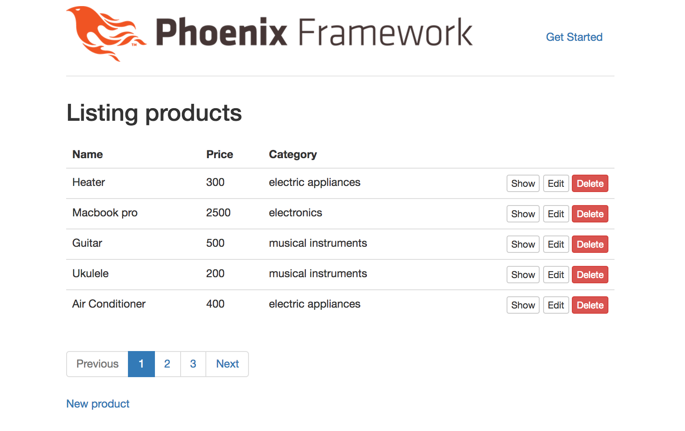


  - #### Sorting:
  Replace table headers on the `index.html.eex` with sort links (Make sure that the headers are actual columns in the
  table in the database.)

  Replace this:
  ```elixir
    <th>Name</th>
    <th>Price</th>
    <th>Category</th>
  ```

  With:
  ```elixir
    <th><%= sort_link :name, @conn, @rummage %></th>
    <th><%= sort_link :price, @conn, @rummage %></th>
    <th><%= sort_link :category, @conn, @rummage %></th>
  ```

  Reload and this is how your page should look with sortable links instead of just table headers:

  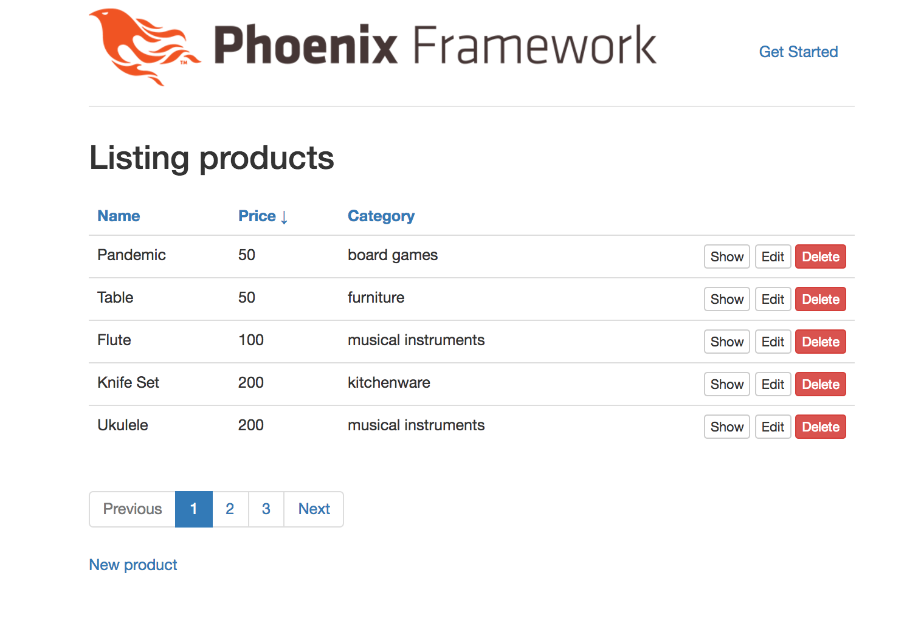

  **NOTE: Currently working on adding better elements to the views, soon the text
  arrow in the sort links will be replaced by an icon**

  - ### Searching:
  Add a search form in the `index.html.eex` with searchable fields:

  ```elixir
  <%= search_form(@conn, [:name], @rummage) %>
  ```

  Reload and your page should look somewhat like this:
  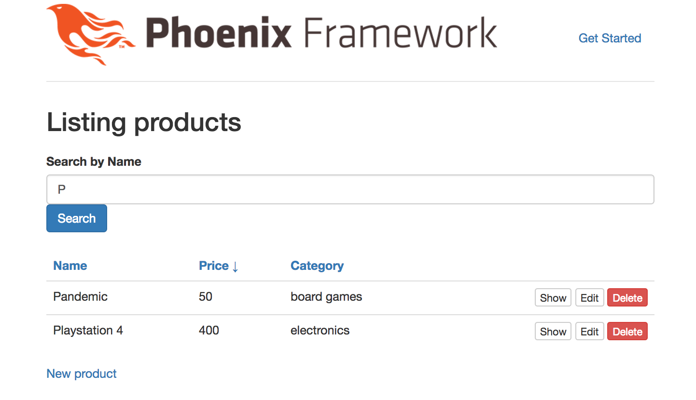

  - #### ALL TOGETHER:
  The best part about `Rummage` is that all the three hooks/operations integrate seamlessly without affecting each other's functionality
  and therefore, you have a page looking somewhat like this:

  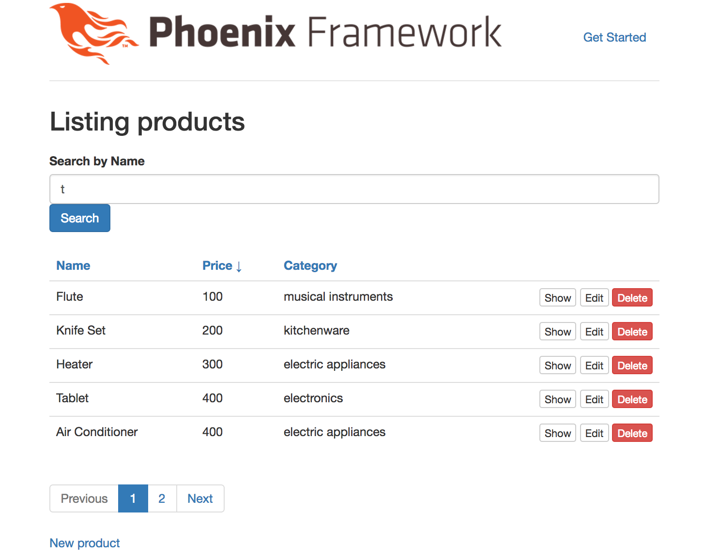

## More Screenshots

### Before rummage
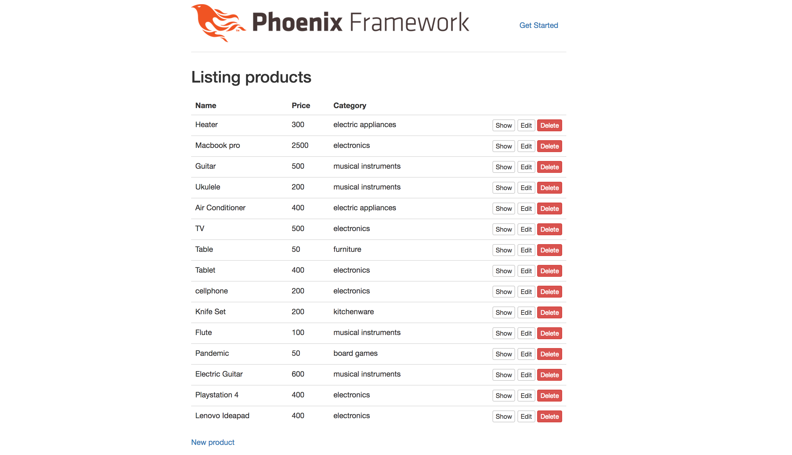

### After Pagination:

- Default pagination:

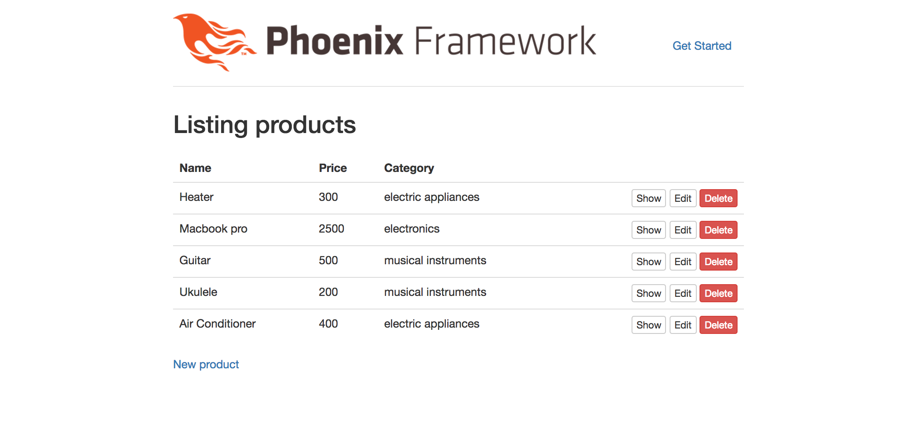

- Custom pagination params:

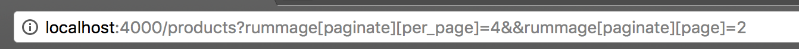
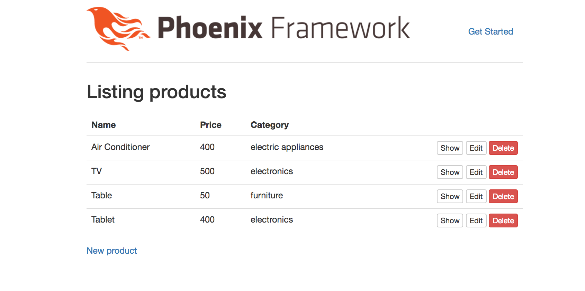

### After Pagination View:

- Default


- Custom pagination params


### After Sort:


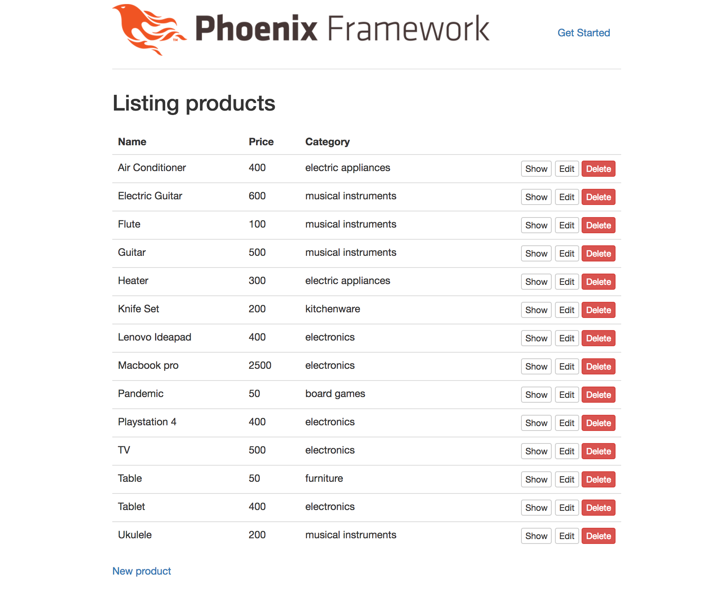


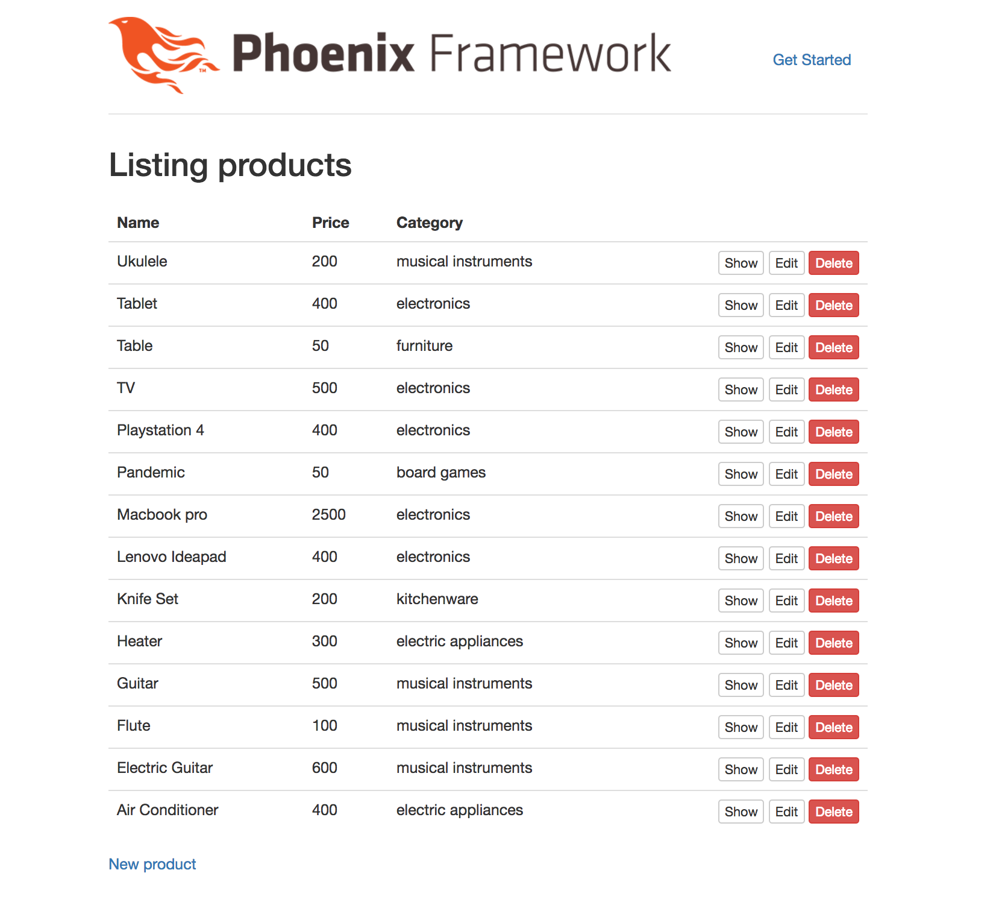

### After Sort View:


### After Search:

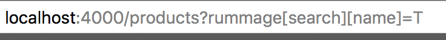
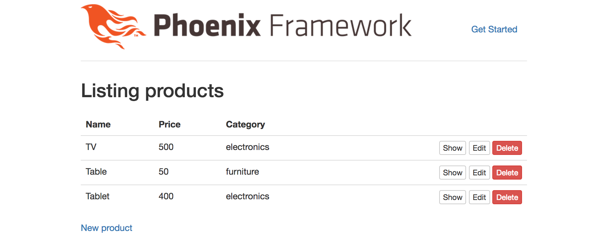

### After Search View:


## Coming up Next:

- Better sort links using icons instead of arrows.
- Not having to pass repo, helpers and model while using view, if default.
- Not having to pass repo, helpers and model while using controller, if default.
- A Video with the demo.


